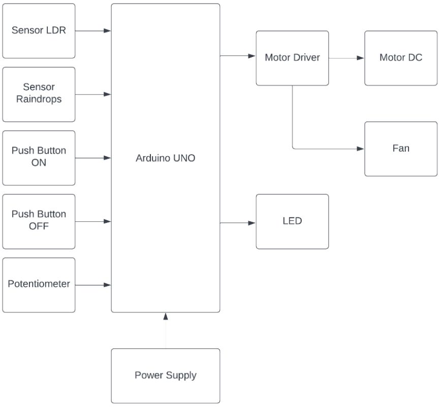

# Smart Automatic Clothesline

## Deskripsi
Proyek ini merupakan prototipe sistem otomatis untuk jemuran pakaian pintar yang dikendalikan oleh sistem embedded untuk mengoptimalkan penggunaan tali jemuran baju di luar ruangan. Smart Automatic Clothesline memastikan pakaian tetap kering dan terhindar dari hujan atau kelembapan. Proyek ini menggunakan dua jenis sensor untuk mendeteksi perubahan lingkungan dan otomatis mengatur posisi tali jemuran.
Fitur Utama:
1. **Automatisasi**: Menyesuaikan posisi jemuran berdasarkan kondisi lingkungan, seperti sinar matahari dan hujan.
2. **Kontrol Manual**: Menggunakan push button untuk pengendalian manual yang memberikan fleksibilitas kepada pengguna.
3. **Pengeringan Pakaian**: Menggunakan mini fan untuk mempercepat proses pengeringan pakaian jika dibutuhkan.

## Tujuan
Membuat sistem otomatis yang dapat membantu pemilik rumah untuk menjaga pakaian tetap kering, menghindari hujan secara otomatis, dan mempercepat proses pengeringan dengan menggunakan angin buatan yang dikendalikan secara otomatis oleh mikrokontroler.

## Komponen
1. **Sensor LDR (Light Dependent Resistor)**: Mengukur intensitas cahaya di sekitar untuk menentukan apakah kondisi lingkungan cocok untuk mengeringkan pakaian.
2. **Sensor Raindrop**: Mendeteksi keberadaan tetesan air hujan untuk menentukan apakah kondisi cuaca sedang basah atau tidak.
3. **Push Button**: Mengaktifkan dan mematikan sistem secara manual sesuai kebutuhan pengguna serta masuk ke mode pengaturan sensitivitas sistem.
4. **Potentiometer**: Mengatur sensitivitas intensitas cahaya dari sistem.
5. **LED**: Indikator status sistem dalam kondisi aktif atau tidak.
6. **Motor DC**: Menggerakkan tali jemuran secara otomatis berdasarkan masukan dari sensor.
7. **Mini Fan**: Membantu pengeringan pakaian secara otomatis ketika kondisi cuaca sedang basah.

  

## Circuit Diagram
<a href="assets/diagrams/schematic_diagram.png" target="_blank">
  <button style="background-color: #4CAF50; color: white; padding: 10px 20px; border: none; border-radius: 5px; cursor: pointer; font-size: 16px;">
    Schematic Diagram
  </button>
</a>

## Model 3D Prototipe
<a href="assets/prototipe_model/Smart_Automatic_Clothesline_Prototipe.stl" target="_blank">
  <button style="background-color: #4CAF50; color: white; padding: 10px 20px; border: none; border-radius: 5px; cursor: pointer; font-size: 16px;">
    3D Model Prototipe Smart Automatic Clothesline
  </button>
</a>

## Dokumentasi Proyek

  
  

## 🚀 Getting Started
1. Clone the repository
2. Open `src/main.ino` in Arduino IDE
3. Connect components as shown in the schematic
4. Upload to Arduino Uno
5. Power on and test the system
